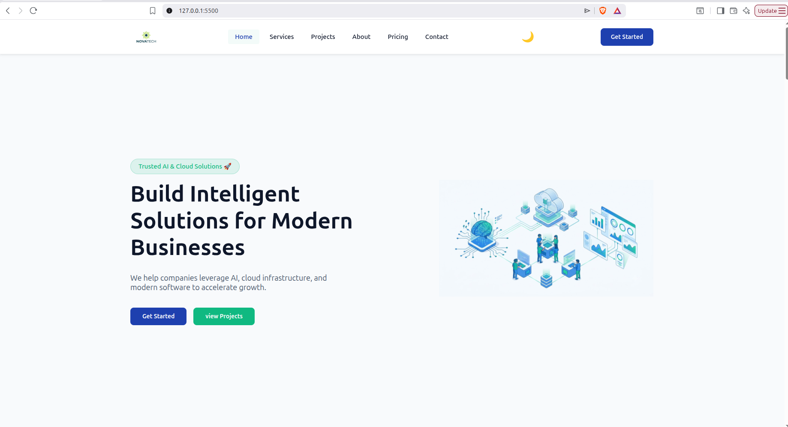
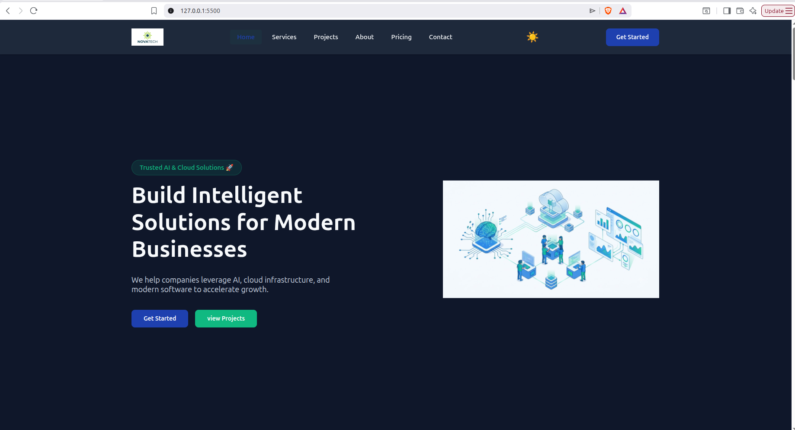

#NovaTech

Modern responsive business landing page built with HTML, CSS, and Javascript (ES6 Modules). The project demonstrates clean UI design, reusable components, iteractive features, and responsive layouts without using any frameworks.

---

## ✨ Features

- 📱 Fully responsive design
- 🌙 Dark mode toggle
-  🔍 Project Search
- 🗂️ Project category filtering
- 🪟 Project detail modal
- 📈 Animated statistics counters
- 🎬 Scroll reveal animations
- 📨 Contact form validation
- ⬆️ Back-to-top button
- 📍 Active navigation on scroll
- 🍔 Mobile navigation menu 

---

## Technologies

- HTML5
- CSS3
- JavaScript (ES6 Modules) 

```text
NovaTech/
│
├── css/
├── images/
├── js/
│   ├── components/
│   ├── data/
│   ├── features/
│   ├── utils/
│   └── main.js
│
├── index.html
└── README.md
```
---

## 📸 Screeshots

### Light Mode 



### Dark Mode



### Mobile


```


## 🚀 Installation
clone the repository

```bash
git clone https://github.com/Bilal-47-ng/NovaTech.git
```
Open the project:

```bash
cd NOvaTech
```

Run with Vs code Live Server or any local web server.

---

## 🎯 Learning objectives

This project was built to practice.

- Responsive web design
- Dom manipulation
- ES6 Modules
- Event Handling
- Component-based JavaScript
- CLean Project Structure
-Git GitHub Workflow

---

GitHub:

https://github.com/Bilal-47-ng

---

## 📄 License

This project is for learning and portfolio purposes.
